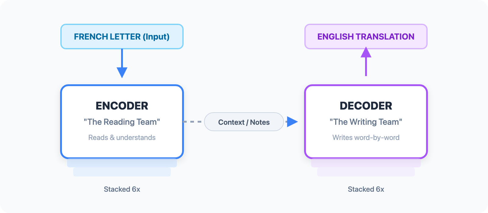

# Understanding Transformers
### A Beginner-Friendly, Step-by-Step Guide — With Real Examples

> *Based on "Attention Is All You Need" — Vaswani et al., 2017*
---

## What Is a Transformer?

Imagine you're translating a letter from French to English. As a human translator, you don't read the French word-by-word and immediately write the English equivalent. Instead, you **read the whole sentence first**, understand its meaning, and *then* write the translation — glancing back at the original as you go.

That's essentially what a Transformer does.

A **Transformer** is a neural network architecture designed to process sequences of data — like sentences — by reading the entire input at once and figuring out which parts matter most for each output. It was introduced in a 2017 Google paper called  *[Attention Is All You Need](https://arxiv.org/abs/1706.03762) *, and it became the foundation of every major AI language model today: **GPT**, **BERT**, **LLaMA**, **Gemini**, and many more.

In summary, a transformer takes a sequence of tokens (words or subwords) as input and produces a sequence of tokens as output. It does this using a mechanism called **self-attention**, which lets every token "look at" every other token and decide how much each one matters for understanding its own meaning.

> **Example:** In the sentence *"The animal didn't cross the street because it was too tired"*, the word "it" refers to "animal" — not "street". Self-attention lets the model figure this out by connecting "it" strongly to "animal".

---

## Why Not Just Use RNNs?

### Before Transformers

Before Transformers, the most common approach was **Recurrent Neural Networks (RNNs)**. Think of an RNN like a librarian who reads a book one page at a time, taking notes as they go—but can only keep a short summary in their head. By page 200, most of the details from page 3 have faded.

This leads to two major problems:

- **Slow training** — each step depends on the previous one, so computation can’t be parallelized
- **Weak long-range memory** — information from earlier in the sequence becomes harder to retain

**LSTMs** (Long Short-Term Memory networks) improved this by giving the librarian a better notepad—but they still read one page at a time.

### The Solution

A Transformer is like giving every page in the book a set of sticky notes that say: *"Here are the most relevant parts of the entire book for me."* Each page can directly reference any other page—and assign different levels of importance to them—all at the same time.

| Model | Analogy | Key Problem |
|-------|---------|-------------|
| **RNN** | Librarian reading one page at a time, keeping brief notes | Slow + weak long-range memory |
| **LSTM** | Same librarian, but with a better notepad | Still sequential, still slow |
| **Transformer** | Every page connects to every other page at once | Higher memory usage, but far more efficient |

> **The core advantage:** Transformers process entire sequences in parallel, enabling efficient GPU training and much stronger modeling of long-range relationships.
---

## The Big Picture

### Analogy: A Professional Translation Team

Think of the Transformer as a professional translation agency with two departments:
- **The Encoder** is the *reading team*. They read the original French letter and create a rich, contextual representation of the entire sentence—not just word-by-word, but capturing meaning and nuance.
- **The Decoder** is the *writing team*. They take that representation and produce the English translation, one word at a time, while consulting the reading team's notes as needed.



Both the Encoder and Decoder are made of **stacked layers**—typically 6. Each layer refines the token representations further, like passing notes through a chain of reviewers.

### What Each Part Does

| Component | Team Role | What It Does |
|-----------|-----------|--------------|
| **Token Embedding** | Vocabulary lookup | Converts each word into a numeric vector |
| **Positional Encoding** | Word order tracker | Adds "I am word #3" information to each token |
| **Self-Attention** | Context analyzer | Determines which tokens influence each other and by how much |
| **Feed-Forward Network** | Individual thinker | Processes each token's representation independently |
| **Layer Norm** | Quality checker | Stabilizes values for smoother training |
| **Cross-Attention** | Bridge between teams | Lets the decoder consult the encoder's representations |
---

## Step 0 — Tokenization
### Breaking Text Into Model-Readable Pieces

> **TL;DR:** Raw text → integer IDs. The model never sees words directly.

Before any math happens, there's a step most tutorials skip: **tokenization**.

A Transformer doesn't read words — it reads **tokens**, which are small chunks of text. The popular approach is **Byte-Pair Encoding (BPE)**, used by GPT-4, and **WordPiece**, used by BERT.

- The word `"running"` → `["run", "##ning"]` — two tokens
- The word `"ChatGPT"` → `["Chat", "G", "PT"]` — three tokens
- Common words like `"the"` → `["the"]` — one token

Each token gets mapped to an integer ID:
```
"The cat sat" → [464, 3797, 3332]
```

These IDs are the actual input to the model — **not the words themselves**. This matters because:
1. We can represent any word, even ones not in training data, by splitting into subwords
2. The vocabulary stays manageable (~50,000 tokens vs. millions of possible words)
3. The model learns patterns at the subword level, which helps with morphology

---

## Step 1 — Token Embedding
### Turning Words into Numbers

> **TL;DR:** Token ID → 512 floating-point numbers that capture meaning.

### Analogy: The Airport Check-In Number
When you check in at an airport, you're assigned a seat number — say, **42A**. That number uniquely identifies you. But a seat number alone doesn't tell the plane anything about you: your weight, your preferences, whether you need extra legroom.

Embedding is like upgrading from a seat number to a **full passenger profile** — a rich description that captures everything relevant about you as a number (so the computer can process it).

In NLP:
- Each word in our vocabulary gets assigned an integer ID (like a seat number)
- The **embedding layer** maps that ID to a long list of numbers — say, 512 numbers — called a **vector**
- This vector is *learned* during training, so similar words end up with similar vectors

### Concrete Example


In real models, each vector has **512 dimensions** (not 4). The model learns which dimensions capture grammar, meaning, tense, etc.

### The Code

```python
class Embedding(nn.Module):
    def __init__(self, vocab_size, embed_dim):
        """
        vocab_size : how many unique words/tokens exist (e.g. 50,000)
        embed_dim  : how many numbers represent each token (e.g. 512)
        """
        super(Embedding, self).__init__()

        # nn.Embedding is just a big lookup table:
        # shape → [vocab_size, embed_dim]
        # Give it a token ID, it returns that row.
        self.embed = nn.Embedding(vocab_size, embed_dim)

    def forward(self, x):
        """
        x   : a batch of token ID sequences
              shape → [batch_size, sequence_length]
              e.g.  → [[0, 1, 2], [3, 1, 0]]  (two sentences of 3 tokens each)

        out : the embedding vectors for every token
              shape → [batch_size, sequence_length, embed_dim]
              e.g.  → [2, 3, 512]
        """
        out = self.embed(x)
        return out
```

> **Key insight:** The numbers in an embedding vector are not hand-designed. They start random and are *learned* during training. By the end, words like "king" and "queen" end up close together in this 512-dimensional space, because they appear in similar contexts.

---

## Step 2 — Positional Encoding
### Giving Tokens a Sense of Order

> **TL;DR:** Adds a unique "position fingerprint" to each token vector so the model knows word order.

### The Problem: Attention Is Orderblind
Here's a puzzle. Consider these two sentences:

- *"The dog bit the man"*
- *"The man bit the dog"*

Same words, totally different meanings. Word order matters enormously.

But self-attention, by default, doesn't care about order — it just looks at which tokens relate to which. If you shuffled the words in a sentence, the attention mechanism would produce the same result (just with shuffled outputs). That's a disaster.

### Analogy: Numbered Queue Tickets

Imagine you're at a bakery with a queue ticket. The bakery doesn't know who arrived first just by looking at people — everyone looks the same. But each ticket has a unique number. The bakery calls ticket #1, then #2, and so on.

**Positional encoding** is like stamping a queue ticket onto each token's vector. Now when the model looks at any token, it knows not just *what* that token is, but *where* it appears in the sentence.

### How It Works

Instead of learned positions, the original Transformer uses fixed mathematical patterns — sine and cosine waves at different frequencies. Here's the intuition:


Each position gets a unique "fingerprint" of waves. Like a radio station — each station broadcasts at a different frequency, so you can tell them apart even if the signals look similar.

The actual formula from the paper:

$$ \text{PE}(\text{pos}, 2i) = \sin\left(\frac{\text{pos}}{10000^{2i/d_{\text{model}}}}\right) $$
$$ \text{PE}(\text{pos}, 2i+1) = \cos\left(\frac{\text{pos}}{10000^{2i/d_{\text{model}}}}\right) $$

Where $\text{pos}$ = position in sequence, $i$ = which dimension, $d_{\text{model}} = 512$.

These encodings are **added** directly to the embeddings — so each token's vector now carries both its *meaning* and its *position*.

### The Code

```python
class PositionalEncoding(nn.Module):
    def __init__(self, d_model, max_seq_length):
        """
        d_model        : size of each token's vector (e.g. 512)
        max_seq_length : longest sequence we'll ever see (e.g. 100)
        """
        super(PositionalEncoding, self).__init__()

        # Start with a blank grid of zeros: [max_seq_length, d_model]
        pe = torch.zeros(max_seq_length, d_model)

        # Create a column of position numbers: [0, 1, 2, ..., max_seq_length-1]
        position = torch.arange(0, max_seq_length, dtype=torch.float).unsqueeze(1)

        # Frequency scaling — each dimension gets a different frequency
        # This is the 1 / 10000^(2i/d_model) part of the formula
        div_term = torch.exp(
            torch.arange(0, d_model, 2).float() * -(math.log(10000.0) / d_model)
        )

        # Even dimensions (0, 2, 4, ...) → sine wave
        pe[:, 0::2] = torch.sin(position * div_term)

        # Odd dimensions (1, 3, 5, ...) → cosine wave
        pe[:, 1::2] = torch.cos(position * div_term)

        # Store as a fixed buffer (not a learned parameter)
        # Add a batch dimension: shape becomes [1, max_seq_length, d_model]
        self.register_buffer('pe', pe.unsqueeze(0))

    def forward(self, x):
        """
        x : token embeddings, shape [batch_size, seq_length, d_model]

        We slice pe to match the actual sequence length (x.size(1))
        and simply ADD it to the embeddings.
        """
        return x + self.pe[:, :x.size(1)]
```

> **Why add instead of concatenate?** Adding keeps the vector size at 512. Concatenating would double it to 1024, increasing computation. The model learns to separate the "meaning" signal from the "position" signal even though they share the same space.

---

## Step 3 — Multi-Head Attention
### The Heart of the Transformer

> **TL;DR:** Every token looks at every other token and decides how much each one matters — from 8 different perspectives simultaneously.

This is the most important concept in the whole architecture. Take your time here.

### Analogy: A Job Interview Panel

Imagine you're being interviewed for a job, and there are three people on the panel:

- **The HR manager** asks: *"What's your personality like?"*
- **The tech lead** asks: *"What are your technical skills?"*
- **The project manager** asks: *"How do you handle deadlines?"*

Each interviewer is asking about a different *aspect* of you. You give different answers to each (even though you're the same person), and together they build a complete picture.

In multi-head attention, each **attention head** is like one interviewer — looking at the sentence from a different angle. One head might focus on grammatical relationships, another on semantic similarity, another on long-range references.

### Part A: Scaled Dot-Product Attention

First, let's understand single-head attention. Every token plays **three roles simultaneously**:

| Role | Symbol | Question it answers |
|------|--------|-------------------|
| **Query** | Q | "What am I looking for?" |
| **Key** | K | "What do I contain / offer?" |
| **Value** | V | "What information should I share?" |

Think of it like a search engine:
- Your search query is Q
- Every webpage has a K (keywords) and V (actual content)
- The search engine scores Q against all K's, then returns a weighted mix of V's

#### Concrete Example — One Sentence

Sentence: *"The cat sat on the mat"*

When computing attention for the word **"sat"**:


The output for "sat" now contains information *from* "cat" and "mat" — it has context!

#### The Formula

$$ \text{Attention}(Q, K, V) = \text{softmax}\left(\frac{QK^T}{\sqrt{d_k}}\right)V $$

The $\sqrt{d_k}$ scaling (where $d_k = 64$ for 8 heads with $d_{\text{model}}=512$) prevents the dot products from becoming so large that softmax returns near-zero gradients — which would stop learning.

### Part B: Multi-Head = Multiple Perspectives

Instead of doing attention once with a 512-dim space, we do it **8 times in parallel**, each in a 64-dim space. Each run is one "head". Then we concatenate all 8 results and project back to 512.


> **Important:** The model decides what each head focuses on — we don't tell it. These descriptions are just what researchers have observed after training.

### The Code

```python
class MultiHeadAttention(nn.Module):
    def __init__(self, d_model, num_heads):
        """
        d_model   : total model dimension (e.g. 512)
        num_heads : how many attention heads to run in parallel (e.g. 8)

        Each head operates on d_model // num_heads = 64 dimensions.
        """
        super(MultiHeadAttention, self).__init__()
        assert d_model % num_heads == 0, "d_model must be divisible by num_heads"

        self.d_model   = d_model
        self.num_heads = num_heads
        self.d_k       = d_model // num_heads  # 512 // 8 = 64

        # Four linear projections: one each for Q, K, V, and the output
        # All have shape [d_model, d_model] — they project the full 512-dim space
        self.W_q = nn.Linear(d_model, d_model)
        self.W_k = nn.Linear(d_model, d_model)
        self.W_v = nn.Linear(d_model, d_model)
        self.W_o = nn.Linear(d_model, d_model)

    def scaled_dot_product_attention(self, Q, K, V, mask=None):
        """
        The core formula: softmax(Q × Kᵀ / √d_k) × V

        Q, K, V shapes: [batch, heads, seq_len, d_k]
        Returns:        [batch, heads, seq_len, d_k]
        """
        # Step 1: Compute raw attention scores
        # Q × Kᵀ gives a [seq_len × seq_len] matrix of scores
        attn_scores = torch.matmul(Q, K.transpose(-2, -1)) / math.sqrt(self.d_k)

        # Step 2: Apply mask (optional)
        # In the decoder, we set future positions to -1e9 (≈ -infinity)
        # so softmax turns them into 0 — the model can't peek at the future
        if mask is not None:
            attn_scores = attn_scores.masked_fill(mask == 0, -1e9)

        # Step 3: Softmax over the last dimension → attention weights (sum to 1)
        attn_probs = torch.softmax(attn_scores, dim=-1)

        # Step 4: Weighted sum of Values
        return torch.matmul(attn_probs, V)

    def split_heads(self, x):
        """
        Reshape from [batch, seq, d_model]
                  to [batch, heads, seq, d_k]

        This splits the 512 dimensions into 8 heads × 64 dimensions each.
        """
        batch_size, seq_length, d_model = x.size()
        return x.view(batch_size, seq_length, self.num_heads, self.d_k).transpose(1, 2)

    def combine_heads(self, x):
        """
        Reverse of split_heads:
        Reshape from [batch, heads, seq, d_k]
                  to [batch, seq, d_model]
        """
        batch_size, _, seq_length, d_k = x.size()
        return x.transpose(1, 2).contiguous().view(batch_size, seq_length, self.d_model)

    def forward(self, Q, K, V, mask=None):
        """
        In the encoder: Q = K = V = x  (same input for all three — "self" attention)
        In the decoder cross-attention: Q = decoder state, K = V = encoder output
        """
        # Project inputs and split into heads
        Q = self.split_heads(self.W_q(Q))   # [batch, 8, seq, 64]
        K = self.split_heads(self.W_k(K))   # [batch, 8, seq, 64]
        V = self.split_heads(self.W_v(V))   # [batch, 8, seq, 64]

        # Run attention for all 8 heads simultaneously
        attn_output = self.scaled_dot_product_attention(Q, K, V, mask)

        # Merge the 8 heads back into one and project to d_model
        return self.W_o(self.combine_heads(attn_output))  # [batch, seq, 512]
```

> **Why is it called "self" attention?** Because in the encoder, the same input `x` is used for Q, K, and V. Each token is asking questions about *itself* in relation to the rest of the sequence. It's introspective — the sequence is attending to itself.

---

## Step 4 — Feed-Forward Network
### Individual Thinking Time

> **TL;DR:** After tokens communicate via attention, each one independently processes its own representation through a two-layer neural network.

### Analogy: The Expert Consultant

After the interview panel (attention), imagine each candidate is sent to a private room with an expert consultant who gives them **individual, tailored advice** — completely independently of what advice other candidates receive. The consultant doesn't compare candidates; they just work deeply with the one person in front of them.

This is the **feed-forward network (FFN)**: after attention has gathered information from across the sequence, the FFN processes **each token individually** to deepen its representation.

### What It Does

The FFN is a simple two-layer neural network applied **identically to every position** in the sequence, but independently:


The **expansion to 2048** (4× the model size) gives the network extra capacity — like giving the consultant a large whiteboard to work through complex ideas before delivering a concise summary.

### The Formula

$$ \text{FFN}(x) = \max(0, xW_1 + b_1)W_2 + b_2 $$

### The Code

```python
class PositionWiseFeedForward(nn.Module):
    def __init__(self, d_model, d_ff):
        """
        d_model : input/output size (e.g. 512)
        d_ff    : inner hidden size — typically 4 × d_model (e.g. 2048)
                  The expansion gives the network more room to "think"
        """
        super(PositionWiseFeedForward, self).__init__()

        self.fc1  = nn.Linear(d_model, d_ff)   # 512 → 2048 (expand)
        self.fc2  = nn.Linear(d_ff, d_model)   # 2048 → 512 (compress back)
        self.relu = nn.ReLU()                   # keep only positive values

    def forward(self, x):
        """
        x shape in  : [batch_size, seq_length, d_model]  e.g. [32, 10, 512]
        x shape out : [batch_size, seq_length, d_model]  e.g. [32, 10, 512]

        The same two-layer network runs on EVERY position independently.
        Think of it as: for each token, expand → activate → compress.
        """
        return self.fc2(self.relu(self.fc1(x)))
```

> **💡 Attention vs FFN — what's the difference?**
> - **Attention** = tokens talking to *each other* (cross-token communication)
> - **FFN** = each token thinking *for itself* (within-token computation)
> Together they cover both bases: understanding context AND processing meaning.

---

## Step 5 — Encoder Layer
### Reading & Understanding

> **TL;DR:** One complete "pass" — attention to gather context, then FFN to process it. Repeat 6×.

### Analogy: One Round of a Book Club

Imagine a book club that meets weekly. Each meeting (= each encoder layer) has two phases:

1. **Discussion phase** (Self-Attention): everyone shares their understanding with the group. *"I think this chapter connects to chapter 3 because..."* — members update their views based on what others say.
2. **Personal reflection phase** (Feed-Forward): everyone goes home and writes their own updated notes privately.

After one meeting, understanding has deepened. After 6 meetings (6 encoder layers), the group has a very rich shared understanding of the book.

### The "Add & Norm" Trick

After each phase, there are two stability tricks:

**Residual connection (Add):** The input is added back to the output. Why? If a layer learns something harmful, the original signal still flows through unchanged. It's like always keeping a backup copy before editing a document.

```
output = LayerNorm(x + sublayer(x))
         ↑           ↑    ↑
       normalize  backup  new stuff
```

**Layer normalization (Norm):** Rescales the numbers to have a consistent range. Without this, values can explode or vanish as they flow through 6+ layers, making training impossible.

### What Flows Through the Encoder


### The Code

```python
class EncoderLayer(nn.Module):
    def __init__(self, d_model, num_heads, d_ff, dropout):
        """
        d_model   : model dimension (512)
        num_heads : number of attention heads (8)
        d_ff      : feed-forward inner size (2048)
        dropout   : randomly zero out values during training to prevent overfitting
        """
        super(EncoderLayer, self).__init__()
        self.self_attn    = MultiHeadAttention(d_model, num_heads)
        self.feed_forward = PositionWiseFeedForward(d_model, d_ff)
        self.norm1        = nn.LayerNorm(d_model)  # normalizer after attention
        self.norm2        = nn.LayerNorm(d_model)  # normalizer after FFN
        self.dropout      = nn.Dropout(dropout)

    def forward(self, x, mask):
        """
        x    : token representations, shape [batch, seq_len, d_model]
        mask : padding mask — tells attention to ignore PAD tokens

        Returns the same shape [batch, seq_len, d_model] but with richer values.
        """
        # ── Phase 1: Self-Attention ──────────────────────────────────────────
        # Note: Q = K = V = x  →  "self" attention (tokens attend to themselves)
        attn_output = self.self_attn(x, x, x, mask)

        # Add & Norm: keep original x as backup, normalize the result
        x = self.norm1(x + self.dropout(attn_output))

        # ── Phase 2: Feed-Forward ────────────────────────────────────────────
        ff_output = self.feed_forward(x)

        # Add & Norm again
        x = self.norm2(x + self.dropout(ff_output))

        return x
```

---

## Step 6 — Decoder Layer
### Writing the Answer

> **TL;DR:** Uses masked self-attention (can't peek at future), then cross-attention (reads encoder's output), then FFN. Also runs 6×.

### Analogy: Writing a Translation, Word by Word

Now we switch to the writing team. The decoder has a harder job: it must generate the output sequence **one token at a time**, using two sources of information:

1. **What it has already written** (its own previous outputs)
2. **The full encoded representation of the input** (the encoder's output)

This creates three sub-layers instead of two.

### The Three Sub-layers Explained

#### Sub-layer 1: Masked Self-Attention (No Peeking!)

When writing word #5 of the translation, the decoder can use words #1–4 that it already wrote — but it **cannot** look at words #6, #7, etc. (those haven't been generated yet).

This is enforced by a **causal mask** — a triangular filter that blocks future positions:


#### Sub-layer 2: Cross-Attention (Consulting the Encoder)

Here's the bridge between the two teams. The **decoder's queries** (what am I looking for?) are matched against the **encoder's keys and values** (what did we understand about the input?).


#### Sub-layer 3: Feed-Forward

Same as the encoder — each position processes its updated representation independently.

### The Code

```python
class DecoderLayer(nn.Module):
    def __init__(self, d_model, num_heads, d_ff, dropout):
        super(DecoderLayer, self).__init__()

        # Three attention mechanisms:
        self.self_attn  = MultiHeadAttention(d_model, num_heads)  # masked (past only)
        self.cross_attn = MultiHeadAttention(d_model, num_heads)  # reads encoder output
        self.feed_forward = PositionWiseFeedForward(d_model, d_ff)

        # Three normalizers (one after each sub-layer)
        self.norm1 = nn.LayerNorm(d_model)
        self.norm2 = nn.LayerNorm(d_model)
        self.norm3 = nn.LayerNorm(d_model)
        self.dropout = nn.Dropout(dropout)

    def forward(self, x, enc_output, src_mask, tgt_mask):
        """
        x          : decoder's current token representations [batch, tgt_len, d_model]
        enc_output : encoder's final output [batch, src_len, d_model]
        src_mask   : padding mask for encoder output
        tgt_mask   : causal mask (blocks future positions) + padding mask
        """
        # ── Sub-layer 1: Masked Self-Attention ───────────────────────────────
        # Q = K = V = x, but tgt_mask blocks future positions
        attn_output = self.self_attn(x, x, x, tgt_mask)
        x = self.norm1(x + self.dropout(attn_output))

        # ── Sub-layer 2: Cross-Attention ─────────────────────────────────────
        # Q comes from decoder (what are we looking for?)
        # K and V come from encoder (what does the input contain?)
        attn_output = self.cross_attn(x, enc_output, enc_output, src_mask)
        x = self.norm2(x + self.dropout(attn_output))

        # ── Sub-layer 3: Feed-Forward ────────────────────────────────────────
        ff_output = self.feed_forward(x)
        x = self.norm3(x + self.dropout(ff_output))

        return x
```

> **The key difference between encoder and decoder:**
> - Encoder: all tokens can see all other tokens (full attention)
> - Decoder: tokens can only see *past* tokens in self-attention, but *all* encoder tokens in cross-attention

---

## Step 7 — The Full Transformer
### Putting It All Together

> **TL;DR:** Encoder reads the full input, builds rich representations. Decoder generates output tokens one-at-a-time using both its own previous output and the encoder's memory.

### Analogy: The Complete Translation Pipeline

Let's trace the full journey of translating *"The cat sat"* (English) to *"El gato se sentó"* (Spanish):


### The Two Masks

Before the forward pass, two masks are generated to control what each attention layer can see:

**Mask 1 — Source padding mask:** Input sequences in a batch may have different lengths. Shorter ones are padded with zeros. This mask tells the encoder to ignore the padding tokens.


**Mask 2 — Target causal mask:** Prevents the decoder from seeing future tokens. It's a lower-triangular matrix of 1s (combined with the padding mask).


### The Code

```python
class Transformer(nn.Module):
    def __init__(self, src_vocab_size, tgt_vocab_size,
                 d_model, num_heads, num_layers,
                 d_ff, max_seq_length, dropout):
        """
        src_vocab_size : number of unique tokens in the source language
        tgt_vocab_size : number of unique tokens in the target language
        d_model        : size of every token vector throughout the model (512)
        num_heads      : number of parallel attention heads (8)
        num_layers     : how many encoder + decoder layers to stack (6)
        d_ff           : feed-forward inner dimension (2048)
        max_seq_length : maximum sentence length we support (e.g. 100)
        dropout        : regularisation — randomly zeroes values to avoid overfitting
        """
        super(Transformer, self).__init__()

        # ── Embedding tables ─────────────────────────────────────────────────
        # Source and target languages have separate vocabularies
        self.encoder_embedding = Embedding(src_vocab_size, d_model)
        self.decoder_embedding = Embedding(tgt_vocab_size, d_model)

        # One shared positional encoder (same math for both sides)
        self.positional_encoding = PositionalEncoding(d_model, max_seq_length)

        # ── Stacked layers ───────────────────────────────────────────────────
        # num_layers identical encoder layers (but each learns different weights)
        self.encoder_layers = nn.ModuleList(
            [EncoderLayer(d_model, num_heads, d_ff, dropout) for _ in range(num_layers)]
        )
        # num_layers identical decoder layers
        self.decoder_layers = nn.ModuleList(
            [DecoderLayer(d_model, num_heads, d_ff, dropout) for _ in range(num_layers)]
        )

        # ── Output head ──────────────────────────────────────────────────────
        # Projects the final 512-dim vector to a score for every target word
        # Then softmax converts scores to probabilities
        self.fc = nn.Linear(d_model, tgt_vocab_size)
        self.dropout = nn.Dropout(dropout)

    def generate_mask(self, src, tgt):
        """
        src : source token IDs [batch, src_len]
        tgt : target token IDs [batch, tgt_len]

        Returns two masks:
          src_mask : [batch, 1, 1, src_len]  — hides padding in source
          tgt_mask : [batch, 1, tgt_len, tgt_len] — hides padding + future tokens in target
        """
        # Source mask: 1 where token is real, 0 where it's padding (token ID = 0)
        src_mask = (src != 0).unsqueeze(1).unsqueeze(2)

        # Target padding mask
        tgt_mask = (tgt != 0).unsqueeze(1).unsqueeze(3)

        # Causal mask: lower-triangular matrix of 1s
        # e.g. for length 4:  [[1,0,0,0],[1,1,0,0],[1,1,1,0],[1,1,1,1]]
        seq_length = tgt.size(1)
        nopeak_mask = (
            1 - torch.triu(torch.ones(1, seq_length, seq_length), diagonal=1)
        ).bool()

        # Combine: a target position is visible only if it's (a) real AND (b) not in the future
        tgt_mask = tgt_mask & nopeak_mask
        return src_mask, tgt_mask

    def forward(self, src, tgt):
        """
        src : source token IDs [batch, src_len]   e.g. English sentence IDs
        tgt : target token IDs [batch, tgt_len]   e.g. Spanish sentence IDs (shifted right)

        Returns: [batch, tgt_len, tgt_vocab_size]
                 — a probability score over every target word, for every position
        """
        src_mask, tgt_mask = self.generate_mask(src, tgt)

        # ── ENCODER SIDE ─────────────────────────────────────────────────────
        # Step 1: embed source tokens (IDs → 512-dim vectors)
        # Step 2: add positional encoding
        # Step 3: apply dropout (regularisation)
        src_embedded = self.dropout(
            self.positional_encoding(self.encoder_embedding(src))
        )

        # Step 4: pass through all 6 encoder layers
        enc_output = src_embedded
        for enc_layer in self.encoder_layers:
            enc_output = enc_layer(enc_output, src_mask)
        # enc_output shape: [batch, src_len, 512]

        # ── DECODER SIDE ─────────────────────────────────────────────────────
        # Step 5: embed target tokens
        tgt_embedded = self.dropout(
            self.positional_encoding(self.decoder_embedding(tgt))
        )

        # Step 6: pass through all 6 decoder layers
        # Each decoder layer receives enc_output via cross-attention
        dec_output = tgt_embedded
        for dec_layer in self.decoder_layers:
            dec_output = dec_layer(dec_output, enc_output, src_mask, tgt_mask)
        # dec_output shape: [batch, tgt_len, 512]

        # Step 7: project to vocabulary size and return logits
        output = self.fc(dec_output)
        # shape: [batch, tgt_len, tgt_vocab_size]
        # Apply softmax externally (or use CrossEntropyLoss which includes it)
        return output
```

### Running the Model

```python
# ── Hyperparameters from the original paper ──────────────────────────────────
transformer = Transformer(
    src_vocab_size  = 5000,   # 5000 unique source words
    tgt_vocab_size  = 5000,   # 5000 unique target words
    d_model         = 512,    # every token is a 512-dim vector
    num_heads       = 8,      # 8 attention heads (each sees 64 dims)
    num_layers      = 6,      # 6 encoder layers + 6 decoder layers
    d_ff            = 2048,   # feed-forward expands to 2048 then back to 512
    max_seq_length  = 100,    # max 100 tokens per sentence
    dropout         = 0.1     # 10% of values zeroed out during training
)

# Count parameters
total_params = sum(p.numel() for p in transformer.parameters())
print(f"Total parameters: {total_params:,}")
# → Total parameters: 44,139,520  (44 million!)

# Quick test — random token IDs as a fake batch
src = torch.randint(1, 5000, (2, 10))  # batch of 2 sentences, length 10
tgt = torch.randint(1, 5000, (2, 10))  # batch of 2 target sentences, length 10

output = transformer(src, tgt)
print(output.shape)
# → torch.Size([2, 10, 5000])
# For each of the 2 sentences, at each of the 10 positions,
# we get a score for all 5000 possible next words
```

---

## Quick Recap & What's Next

### Everything in One Diagram


### Concept Cheat Sheet

| Concept | One-Line Summary | Analogy |
|---------|-----------------|---------|
| Token Embedding | Word → 512 numbers | Seat number → full passenger profile |
| Positional Encoding | Adds "I'm word #N" | Queue ticket number |
| Self-Attention | Tokens talk to each other | Group discussion |
| Multi-Head | Attention from 8 angles | Panel of 8 interviewers |
| Feed-Forward | Each token thinks alone | Private expert consultation |
| Encoder | Reads and understands input | Reading department |
| Decoder | Generates output word by word | Writing department |
| Cross-Attention | Decoder reads encoder's notes | Writer consults reader |
| Add & Norm | Stability tricks | Backup + quality check |
| Causal Mask | No peeking at future words | Exam rules |

### What to Explore Next

| Topic | Why It Matters |
|-------|---------------|
| **Training the Transformer** | How backpropagation and the Adam optimizer update all 44M parameters — the "learning" half of the story |
| **BERT** | An encoder-only Transformer (no decoder) trained on masked word prediction. Powers Google Search and most text classification systems |
| **GPT / GPT-4** | A decoder-only Transformer trained to predict the next token. The architecture behind ChatGPT — no encoder, all generation |
| **Vision Transformers (ViT)** | The same attention mechanism applied to *image patches* instead of words. Competitive with or better than CNNs on vision tasks |
| **Flash Attention** | A hardware-aware reimplementation of attention that's 2–4× faster and uses significantly less GPU memory — important for long-context models |
| **LLaMA / Mistral** | Open-source Transformers with architectural improvements: RoPE positional encoding, grouped-query attention, SwiGLU activations |

The Transformer is not a single model — it's a *blueprint*. Once you understand this architecture, every major modern AI system becomes a variation on a theme you already know.

---

*Reference: Vaswani, A., Shazeer, N., Parmar, N., Uszkoreit, J., Jones, L., Gomez, A. N., Kaiser, Ł., & Polosukhin, I. (2017). Attention is all you need. NeurIPS.*